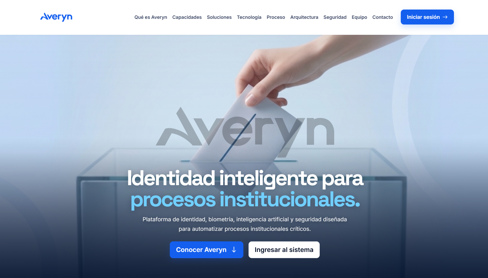
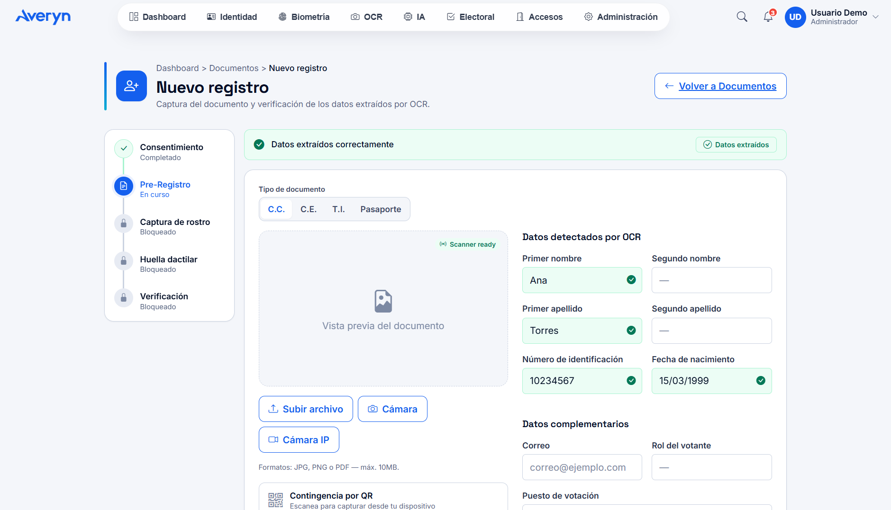
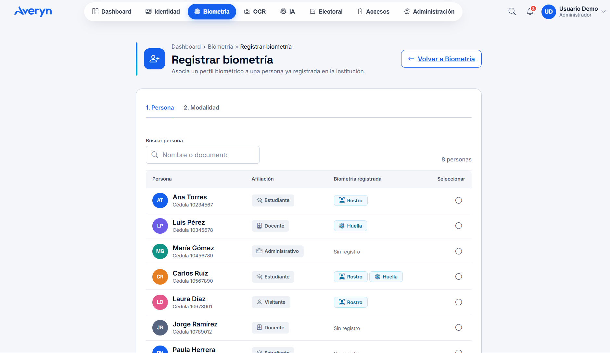

<p align="center">
  
</p>

<h1 align="center">Averyn</h1>

<p align="center">
  Plataforma institucional para la gestión de identidad, biometría, documentos e inteligencia artificial.<br>
  <strong>Sprint 1 — Avance de frontend</strong>
</p>

---

## ¿Qué es Averyn?

Averyn es una plataforma para organizaciones (universidades, empresas y entidades
públicas) que centraliza la **gestión de identidad**, la **verificación biométrica**,
el **procesamiento documental (OCR)**, la **inteligencia artificial** y los
**procesos institucionales** en un mismo panel.

El módulo electoral es solo uno de los procesos posibles: la plataforma está
pensada como una base de identidad institucional, no como una aplicación de
votaciones.

El repositorio es un **monolito modular** con dos partes: `averyn-frontend/`
(trabajo activo del Sprint 1) y `averyn-backend/` (reservado para la siguiente fase).

---

## Avances del Sprint 1

| Módulo | Estado | Qué incluye |
|---|---|---|
| **Design System** | Completo | Tokens (color, tipografía, espaciado, breakpoints) y componentes reutilizables (`design-system.css` por capas + catálogo). |
| **Landing pública** | Completo | Página institucional con hero, secciones informativas y navegación. |
| **Login** | Completo | Formulario con validación, estados de error/carga/éxito y sesión simulada. |
| **Dashboard Shell** | Completo | Navbar superior y **dock flotante** reutilizable por todos los módulos autenticados. |
| **Dashboard** | Completo | Bienvenida, KPIs, accesos rápidos y actividad reciente. |
| **Identidad** | Completo | Listado de personas con búsqueda y filtro por estado, detalle de persona, creación y eliminación. |
| **Documentos / OCR** | Completo | Listado de documentos, carga simulada, resultado OCR editable y wizard de pre-registro. |
| **Biometría** | Completo | Módulo completo: dashboard, **registro biométrico**, **captura facial con cámara real**, **verificación 1:1**, historial y estado de dispositivos. |
| **IA** | En desarrollo | Placeholder "en desarrollo"; el dock no apunta a una ruta rota. |
| **Electoral** | Completo | Listado de procesos con su estado y creación de proceso. |
| **Accesos** | Pendiente | Carpeta de módulo reservada (`.gitkeep`); el dock aún apunta a un 404. |
| **Administración** | Pendiente | Carpeta de módulo reservada (`.gitkeep`); el dock aún apunta a un 404. |

---

## Auditoría Sprint 1 (F1–F4)

Antes de estabilizar la rama se aplicaron correcciones de auditoría sobre el árbol portado:

| Fase | Commit | Qué se corrigió |
|---|---|---|
| **F1 — Datos y flujos** | `31d42d0` | Catálogo único de personas (`personas-catalogo.js`, clave `averyn_personas`) como fuente de verdad para Identidad, Biometría y Electoral; verificación por modalidad seleccionada (gate + panel de huella sin cámara); logout dinámico con guard de sesión (`averyn.session`); el wizard OCR crea/reutiliza la persona y navega a captura con `?modo=registro&persona=<id>`. |
| **F2 — Consistencia visual** | `b20f9c6` | Favicon AVIF en todas las páginas internas; spine de cabecera en Electoral; tipografía de encabezados a *Space Grotesk*; dock sin glow de color (elevación neutra); deduplicación de tokens (`:root` solo en `design-system.css`); landing y login con CDN cdnjs (Bootstrap 5.3.3 + icons 1.11.3) y carga del Design System. |
| **F3 — Trazabilidad** | `737de5c` | KPIs y actividad reciente construidos desde los datos reales de la demo (`averyn_personas`, `averyn.biometria.*`, `averyn_procesos_electorales`) en vez de cifras inventadas; fechas relativas en el historial de documentos; copy del login neutro. |
| **F4 — Robustez** | `737de5c` | Empty state en la tabla de documentos; `procesoEnCreacion.id = generarId()` antes de guardar el proceso electoral; KPIs del módulo de documentos calculados desde la fuente de datos. |

**Próximos pendientes:** módulos de Accesos y Administración (hoy enlaces a 404) y la migración a React (ver *Hoja de ruta*).

---

## Capturas

### Landing pública


### Documentos y OCR — Nuevo registro


### Biometría — Registrar biometría


---

## Cómo ejecutarlo

El proyecto es HTML/CSS/JavaScript sin paso de compilación. Para verlo:

1. Abre la carpeta del repositorio en VS Code.
2. Usa **Live Server** sobre `averyn-frontend/index.html` (punto de entrada público).

> **Nota:** no abras los archivos con `file://`; usa siempre un servidor local.
> La captura biométrica usa la cámara real del navegador (`getUserMedia`), que
> requiere `localhost` o HTTPS; si se niega el permiso, el flujo continúa con un
> panel de reemplazo.

Punto de entrada interno (requiere inicio de sesión simulado): `averyn-frontend/login.html`.

---

## Estructura

```text
averyn/
├── averyn-frontend/
│   ├── index.html                  # Landing pública
│   ├── login.html                  # Login simulado
│   ├── assets/
│   │   ├── css/                    # Design System por capas + CSS del shell
│   │   ├── js/                     # Un script por vista + common/ compartido
│   │   └── images/                 # Logos y recursos de marca
│   ├── dashboard/                  # Shell, dashboard, identidad y documentos
│   ├── biometrics/                 # Dashboard, registro, captura, verificación e historial
│   └── modules/                    # IA, Electoral, Accesos y Admin (IA+Electoral activos)
├── averyn-backend/                 # Reservado (sin implementar)
├── docs/                           # Documentación del proyecto
│   ├── averyn-design-system-horizonte.md    # Documento maestro del Design System "Horizonte"
│   ├── averyn-design-system-horizonte.html  # El mismo sistema, navegable, en un solo archivo
│   ├── design-system.html          # Inicio de la documentación por páginas (docs/ds/)
│   └── diagnostico-densidad-wizard.md
├── DESIGN.md                       # Principios y reglas del Design System
├── PRODUCT.md                      # Contexto del producto
└── README.md
```

---

## Stack

- **HTML + CSS + JavaScript** sin framework (scripts clásicos por vista).
- **Bootstrap 5.3.3** (rejilla y utilidades) y **Bootstrap Icons 1.11.3** vía CDN.
- **Sin librerías de gráficos ni dependencias de UI**: los componentes viven en el Design System.
- Datos **simulados (mock)**: el backend aún no está implementado.

---

## Design System

La apariencia está centralizada, no se define por pantalla:

- `averyn-frontend/assets/css/design-system.css` es el punto de entrada; el contenido
  está dividido por capas: `tokens`, `base`, `components`, `modules` y `dashboard`.
- **La única guía de diseño es "Horizonte" (v1.7).** La referencia es `docs/averyn-design-system-horizonte.md`
  y el catálogo navegable es `docs/averyn-design-system-horizonte.html` (un solo archivo).
  Los valores viven en `averyn-frontend/assets/css/tokens.css`; los principios, en `DESIGN.md`.
- Los módulos que aún no han migrado (Identidad, Documentos, Biometría, Electoral e IA) siguen usando las
  clases anteriores (`.av-*`); su guía se retiró. Al migrar cada módulo se pasa a las clases de Horizonte.

Los módulos consumen estas clases (`.av-*`) en vez de crear estilos propios.

### Enfoque de datos

Se priorizó un panel con **datos simples y trazables** sobre visualizaciones
complejas: cada número del dashboard es un conteo de la capa de datos simulada
(alojada en `localStorage`: `averyn_personas`, `averyn.biometria.*` y
`averyn_procesos_electorales`), no una cifra inventada. La "actividad reciente"
es un log de eventos biométricos. Por esa razón no hay gráficos estadísticos
sin una fuente de datos real detrás.

---

## Hoja de ruta

1. **Pulido de diseño** — completar pendientes visuales: placeholders de los
   módulos de Accesos y Administración, revisión de estados vacíos/error y
   pasadas de accesibilidad (contraste, foco, etiquetas).
2. **Migración a React** — reescribir el frontend sobre **Next.js** (decisión del
   equipo). La migración reutiliza el Design System **Horizonte**: los tokens
   siguen siendo variables CSS y los componentes se construyen con shadcn/ui
   tematizado con esos tokens (detalle, paquetes y ruta por fases en
   `docs/averyn-design-system-horizonte.md`). La capa de datos pasa a un store
   (Contexto o Zustand) que mantiene las mismas claves de `localStorage`.
3. **Backend** — implementar `averyn-backend/` (reservado) y conectar los
   módulos a una API real, reemplazando la capa de datos simulada.

---

## Convenciones de trabajo

- **Ramas:** `feature/<actividad>-<descripcion>` desde `dev` y `fix/<auditoria>-<detalle>`
  desde `main` para correcciones. `dev` es la rama de integración.
- **Commits:** `<tipo>(<alcance>): <descripción>` — `feat`, `fix`, `style`, `docs`, `refactor`.
- **Integración:** los cambios llegan por Pull Request a `dev` y desde `dev` a
  `main`; las correcciones directas (`fix/*`) se fusionan a `main` tras revisión
  y verificación (`node --check` + revisión de referencias).

---

## Equipo

Proyecto académico dirigido por el docente **Sadainer Hernández**.

| Rol | Bloque |
|---|---|
| José Chinchía | Bloque A — Landing y autenticación |
| Jorge Herrera | Bloque B — Dashboard Shell, Identidad y Documentos/OCR |
| Daniel Turizo | Bloque C — Biometría e IA (PO/SM) |
| Mateo Calderón | Bloque D — Módulos de negocio (Electoral, Accesos, Administración) |
